# Wildberries Metrics Dependency Map

Документ описывает текущее ядро расчетов WB accrual-отчета после разбиения на слои:

1. `atoms` - минимальные суммы по CSV-колонкам и условиям.
2. `molecules` - составные расчетные величины из атомов.
3. `cells` - финальные строки отчета, которые показываются пользователю.

Кодовые файлы:

- `src/entities/wildberries-report/model/metrics/atoms.ts`
- `src/entities/wildberries-report/model/metrics/molecules.ts`
- `src/entities/wildberries-report/model/metrics/cells.ts`
- `src/entities/wildberries-report/model/accrual-builder.ts`

## Важное Наблюдение По Колонкам

В текущем `columns.ts` поле `WB_REVENUE_COLUMNS.retailPriceWithDiscount` указывает на колонку `Цена розничная`.

Если бизнес-правило должно брать отдельную колонку `Цена розничная с учетом согласованной скидки`, нужно вернуть это значение в `columns.ts`. Ниже карта отражает текущее состояние кода.

## CSV Источники

| Группа | Колонка CSV | Где используется |
| --- | --- | --- |
| База | `Обоснование для оплаты` | Фильтры `Продажа` / `Возврат`, группировка расходов, правила `net effect` |
| База | `Дата продажи` | Период отчета, динамика по датам |
| База | `Тип документа` | Подтип в структуре списаний |
| База | `Виды логистики, штрафов и корректировок ВВ` | Подтип в структуре списаний |
| База | `Способы продажи и тип товара` | Определение FBS/FBW |
| База | `Склад` | FBS fallback, если схема не найдена напрямую |
| База | `Srid`, `Id корзины заказа` | Связывание строк для определения FBS/FBW |
| Количество | `Кол-во` | Количество продаж, себестоимость продаж |
| Количество | `Количество возврата` | Отмены, возвраты, не выкупы |
| Выручка | `Цена розничная` | Выручка с учетом СПП в текущем коде, схема работы |
| Выручка | `Вайлдберриз реализовал Товар (Пр)` | Выручка без СПП |
| Выручка | `К перечислению Продавцу за реализованный Товар` | Поступления по продажам, `net effect`, перевод в банк |
| Расходы | `Услуги по доставке товара покупателю` | Логистика, перевод в банк |
| Расходы | `Компенсация платёжных услуг/Комиссия за интеграцию платёжных сервисов` | Эквайринг |
| Расходы | `Хранение` | Хранение, перевод в банк |
| Расходы | `Удержания` | Удержания, перевод в банк |
| Расходы | `Операции на приемке` | Операции на приемке, перевод в банк |
| Расходы | `Общая сумма штрафов` | Штрафы, перевод в банк |
| Расходы | `Корректировка Вознаграждения Вайлдберриз (ВВ)` | Корректировка ВВ |
| Расходы | `Возмещение за выдачу и возврат товаров на ПВЗ` | Логистика/ПВЗ |
| Расходы | `Возмещение издержек по перевозке/по складским операциям с товаром` | Возмещение перевозки/складских операций |
| Лояльность | `Компенсация скидки по программе лояльности` | `net effect` для строк лояльности |
| Лояльность | `Стоимость участия в программе лояльности` | `net effect` для строк лояльности |
| Лояльность | `Сумма баллов, удержанных по программе лояльности` | `net effect` для строк лояльности |
| Себестоимость CSV | `Артикул`, `Себестоимость` | Себестоимость по проданным строкам |

## Atoms

Атом - минимальная метрика: одна сумма, один источник данных, максимум одно условие.

| Atom | Формула | CSV-колонки |
| --- | --- | --- |
| `salesQuantity` | `SUM("Кол-во")`, где `Обоснование для оплаты = Продажа` | `Кол-во`, `Обоснование для оплаты` |
| `returnsAndCancellationsQuantity` | `SUM("Количество возврата")` | `Количество возврата` |
| `salesRevenueByRetailPrice` | `SUM("Цена розничная")`, где `Обоснование для оплаты = Продажа` | `Цена розничная`, `Обоснование для оплаты` |
| `salesRevenueBeforeSpp` | `SUM(WB_REVENUE_COLUMNS.retailPriceWithDiscount)`, где `Обоснование для оплаты = Продажа` | Сейчас `Цена розничная`, `Обоснование для оплаты` |
| `returnsRevenueBeforeSpp` | `SUM(WB_REVENUE_COLUMNS.retailPriceWithDiscount)`, где `Обоснование для оплаты = Возврат` | Сейчас `Цена розничная`, `Обоснование для оплаты` |
| `revenueWithoutSpp` | `SUM("Вайлдберриз реализовал Товар (Пр)")`, где `Обоснование для оплаты = Продажа` | `Вайлдберриз реализовал Товар (Пр)`, `Обоснование для оплаты` |
| `salesPayout` | `SUM("К перечислению Продавцу за реализованный Товар")`, где `Обоснование для оплаты = Продажа` | `К перечислению Продавцу за реализованный Товар`, `Обоснование для оплаты` |
| `returnsNetEffect` | `SUM(net effect)`, где `Обоснование для оплаты = Возврат` | Для возврата сейчас берется `К перечислению Продавцу за реализованный Товар` |
| `logisticsAmount` | `ABS(SUM("Услуги по доставке товара покупателю"))` | `Услуги по доставке товара покупателю` |
| `paymentServicesAmount` | `ABS(SUM("Компенсация платёжных услуг/Комиссия за интеграцию платёжных сервисов"))` | `Компенсация платёжных услуг/Комиссия за интеграцию платёжных сервисов` |
| `storageAmount` | `ABS(SUM("Хранение"))` | `Хранение` |
| `withholdingsAmount` | `ABS(SUM("Удержания"))` | `Удержания` |
| `acceptanceOperationsAmount` | `ABS(SUM("Операции на приемке"))` | `Операции на приемке` |
| `finesAmount` | `ABS(SUM("Общая сумма штрафов"))` | `Общая сумма штрафов` |
| `vvCorrectionAmount` | `-SUM("Корректировка Вознаграждения Вайлдберриз (ВВ)")` | `Корректировка Вознаграждения Вайлдберриз (ВВ)` |
| `pvzCompensationAmount` | `ABS(SUM("Возмещение за выдачу и возврат товаров на ПВЗ"))` | `Возмещение за выдачу и возврат товаров на ПВЗ` |
| `transportReimbursementAmount` | `ABS(SUM("Возмещение издержек по перевозке/по складским операциям с товаром"))` | `Возмещение издержек по перевозке/по складским операциям с товаром` |
| `salesLogisticsAmount` | `ABS(SUM("Услуги по доставке товара покупателю"))`, где `Обоснование для оплаты = Продажа` | `Услуги по доставке товара покупателю`, `Обоснование для оплаты` |
| `salesStorageAmount` | `ABS(SUM("Хранение"))`, где `Обоснование для оплаты = Продажа` | `Хранение`, `Обоснование для оплаты` |
| `salesWithholdingsAmount` | `ABS(SUM("Удержания"))`, где `Обоснование для оплаты = Продажа` | `Удержания`, `Обоснование для оплаты` |
| `salesAcceptanceOperationsAmount` | `ABS(SUM("Операции на приемке"))`, где `Обоснование для оплаты = Продажа` | `Операции на приемке`, `Обоснование для оплаты` |
| `salesFinesAmount` | `ABS(SUM("Общая сумма штрафов"))`, где `Обоснование для оплаты = Продажа` | `Общая сумма штрафов`, `Обоснование для оплаты` |
| `cogsFromFile` | `SUM("Кол-во" * "Себестоимость")`, где строка продажи и артикул найден в CSV себестоимости | `Кол-во`, `Артикул поставщика`, COGS CSV: `Артикул`, `Себестоимость` |
| `cogsMatchedRows` | `COUNT(строк продаж с найденной себестоимостью)` | `Артикул поставщика`, COGS CSV: `Артикул`, `Себестоимость` |

## Net Effect

`net effect` используется для группировки расходов, динамики по датам и структуры списаний. Это не одна колонка, а правило выбора суммы для строки.

| Условие по `Обоснование для оплаты` | Источник суммы |
| --- | --- |
| `Продажа`, `Возврат` | `К перечислению Продавцу за реализованный Товар` |
| `Компенсация скидки по программе лояльности` | `ABS("Компенсация скидки по программе лояльности") - ABS("Стоимость участия в программе лояльности") - ABS("Сумма баллов, удержанных по программе лояльности")`; если 0, fallback на `К перечислению...` |
| `Логистика`, `Коррекция логистики` | `К перечислению...`; если 0, отрицательный `ABS("Услуги по доставке товара покупателю")` |
| `Возмещение за выдачу и возврат товаров на ПВЗ` | `К перечислению...`; если 0, отрицательный `ABS("Возмещение за выдачу и возврат товаров на ПВЗ")` |
| `Возмещение издержек по перевозке/по складским операциям с товаром` | `К перечислению...`; если 0, отрицательный `ABS("Возмещение издержек по перевозке/по складским операциям с товаром")` |
| `Хранение` | `К перечислению...`; если 0, отрицательный `ABS("Хранение")` |
| `Обработка товара` | `К перечислению...`; если 0, отрицательный `ABS("Удержания") + ABS("Операции на приемке")` |
| `Удержания`, платная доставка, бронирование, вывод сейчас | `К перечислению...`; если 0, отрицательный `ABS("Удержания")` |
| `Штраф` | `К перечислению...`; если 0, отрицательный `ABS("Общая сумма штрафов")` |
| `Компенсация ущерба`, `Добровольная компенсация при возврате` | `К перечислению...`; если 0, `0` |
| `Коррекция продаж`, `Коррекция эквайринга` | `К перечислению...`; если 0, `Корректировка Вознаграждения Вайлдберриз (ВВ)` |
| Строки лояльности со стоимостью/баллами | `К перечислению...`; если 0, соответствующая колонка лояльности с отрицательным знаком |
| Остальное | `К перечислению...`; если 0, fallback из известных колонок расходов/лояльности |

## Molecules

Молекула - составная величина, которая используется дальше как цельная метрика.

| Molecule | Из чего состоит | Формула |
| --- | --- | --- |
| `revenueBeforeSpp` | `salesRevenueBeforeSpp`, `returnsRevenueBeforeSpp` | `salesRevenueBeforeSpp - returnsRevenueBeforeSpp` |
| `sppAndPromotions` | `revenueBeforeSpp`, atom `revenueWithoutSpp` | `revenueBeforeSpp - revenueWithoutSpp` |
| `returnsExpense` | `returnsNetEffect` | `returnsNetEffect === 0 ? 0 : -ABS(returnsNetEffect)` |
| `wbCommissionAmount` | `revenueBeforeSpp`, `salesPayout` | `revenueBeforeSpp - salesPayout` |
| `marketplaceExpenses` | `wbCommissionAmount` + все общие расходы | `wbCommissionAmount + logisticsAmount + paymentServicesAmount + storageAmount + withholdingsAmount + acceptanceOperationsAmount + finesAmount + vvCorrectionAmount + pvzCompensationAmount + transportReimbursementAmount` |
| `transferToBank` | `salesPayout` минус расходы строк продаж | `salesPayout - salesLogisticsAmount - salesStorageAmount - salesAcceptanceOperationsAmount - salesWithholdingsAmount - salesFinesAmount` |
| `cogs` | `cogsFromFile`, `cogsMatchedRows` | `cogsMatchedRows > 0 ? cogsFromFile : null` |

## Cells

Клетка - финальная строка отчета в группе `Итоги периода`.

| Строка отчета | Слой | Значение |
| --- | --- | --- |
| `Количество продаж` | atom | `salesQuantity` |
| `Отмены, возвраты, не выкупы` | atom | `returnsAndCancellationsQuantity` |
| `Выручка с учетом СПП` | molecule | `revenueBeforeSpp` |
| `Выручка без СПП` | atom | `revenueWithoutSpp` |
| `СПП и акции` | molecule | `sppAndPromotions` |
| `Возвраты` | molecule | `returnsExpense` |
| `Общие затраты по Маркетплейсу` | molecule | `marketplaceExpenses` |
| `Перевод в банк` | molecule | `transferToBank` |
| `Себестоимость` | molecule | `cogs` |
| `Налог` | cell | `revenueBeforeSpp * ((taxRatePercent + vatRatePercent) / 100)` |
| `Маржинальность` | cell | `netProfit / revenueBeforeSpp * 100%` |
| `Чистая прибыль` | cell | `transferToBank - taxAmount - (cogs ?? 0)` |

## Схема Зависимостей

```mermaid
flowchart TD
  A1["salesRevenueBeforeSpp<br/>SUM retailPriceWithDiscount, Продажа"] --> M1["revenueBeforeSpp"]
  A2["returnsRevenueBeforeSpp<br/>SUM retailPriceWithDiscount, Возврат"] --> M1

  A3["revenueWithoutSpp<br/>SUM Вайлдберриз реализовал Товар (Пр), Продажа"] --> C4["cell: Выручка без СПП"]

  M1 --> M3["sppAndPromotions"]
  A3 --> M3

  A5["salesPayout<br/>SUM К перечислению..., Продажа"] --> M4["wbCommissionAmount"]
  M1 --> M4

  M4 --> M5["marketplaceExpenses"]
  A6["logisticsAmount"] --> M5
  A7["paymentServicesAmount"] --> M5
  A8["storageAmount"] --> M5
  A9["withholdingsAmount"] --> M5
  A10["acceptanceOperationsAmount"] --> M5
  A11["finesAmount"] --> M5
  A12["vvCorrectionAmount"] --> M5
  A13["pvzCompensationAmount"] --> M5
  A14["transportReimbursementAmount"] --> M5

  A5 --> M6["transferToBank"]
  A15["salesLogisticsAmount"] --> M6
  A16["salesStorageAmount"] --> M6
  A17["salesAcceptanceOperationsAmount"] --> M6
  A18["salesWithholdingsAmount"] --> M6
  A19["salesFinesAmount"] --> M6

  A20["cogsFromFile<br/>Кол-во * Себестоимость"] --> M7["cogs"]
  A21["cogsMatchedRows"] --> M7

  M1 --> M8["taxAmount"]
  M6 --> M9["netProfit"]
  M8 --> M9
  M7 --> M9
  M9 --> M10["marginRate"]
  M1 --> M10

  A22["salesQuantity"] --> C1["cell: Количество продаж"]
  A23["returnsAndCancellationsQuantity"] --> C2["cell: Отмены/возвраты"]
  M1 --> C3["cell: Выручка с учетом СПП"]
  M3 --> C5["cell: СПП и акции"]
  M5 --> C6["cell: Общие затраты"]
  M6 --> C7["cell: Перевод в банк"]
  M7 --> C8["cell: Себестоимость"]
  M8 --> C9["cell: Налог"]
  M10 --> C10["cell: Маржинальность"]
  M9 --> C11["cell: Чистая прибыль"]
```

## Остальные Группы WB Accrual

| Группа отчета | Текущий расчет | Источники |
| --- | --- | --- |
| `Общие затраты по Маркетплейсу` | Группирует `sumByGroup` по классификатору причин, плюс отдельные клетки `Комиссия ВБ`, `Эквайринг`, `Операции на приемке` | `Обоснование для оплаты`, `net effect`, expense atoms |
| `Схема работы` | Раскладывает продажи по FBS/FBW; база - `salesRevenueByScheme`, fallback - `salesTransferByScheme`, при необходимости масштабируется к `transferToBank` | `Цена розничная`, `К перечислению...`, `Способы продажи и тип товара`, `Srid`, `Id корзины заказа`, `Склад` |
| `Динамика по датам начисления` | `SUM(net effect)` по `Дата продажи`; для отрицательных дат показывает крупнейшее списание по `Обоснование для оплаты` | `Дата продажи`, `Обоснование для оплаты`, `net effect` |
| `Структура: ...` | Топ-3 подтипа внутри причины оплаты по `net effect` | `Обоснование для оплаты`, `Виды логистики, штрафов и корректировок ВВ`, `Тип документа`, `net effect` |
